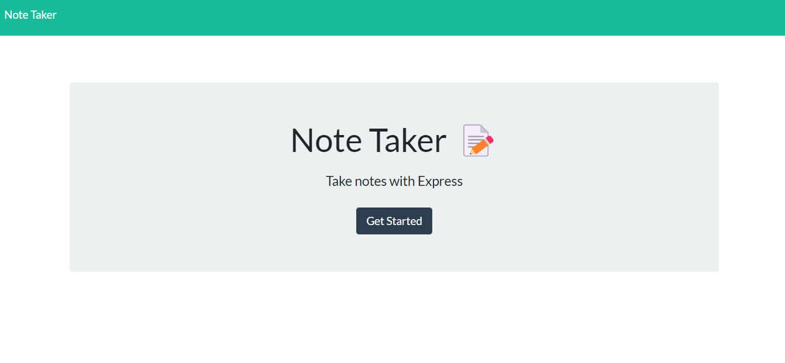

  ## Description

  * This application is a project created to utilize express.js tying together front end and backend development. The app allows a user to write and save notes using data from a JSON file. for this project I was given starter code for the front end while I wrote the backend connecting the two. The application is deployed to heroku on the link I have provided.

  ## Table of Contents

  * [Usage](#usage)
  * [License Info](#license-info)

  ### Usage

  * Click on the "+" symbol to add a new note. Save your note with the disk drive symbol. You may view previous notes by clicking on their text.

  ### License Info

  * [GNU AGPLv3 License](https://www.gnu.org/licenses/agpl-3.0)
  * Permissions of this strongest copyleft license are conditioned on making available complete source code of licensed works and modifications, which include larger works using a licensed work, under the same license. Copyright and license notices must be preserved. Contributors provide an express grant of patent rights. When a modified version is used to provide a service over a network, the complete source code of the modified version must be made available.

# Note Taker
  

  ## application link

  https://immense-wave-00583.herokuapp.com/

  ## Description
  
  * This application is a project created to utilize express.js tying together front end and backend development. The app allows a user to write and save notes using data from a JSON file. for this project I was given starter code for the front end while I wrote the backend connecting the two. The application is deployed to heroku on the link I have provided and was created using html, css, javascript, express, jest, nodemon, and uniqid.

  ## Table of Contents

  * [Screenshot of application](#screenshot-of-application)
  * [Installation](#installation)
  * [Usage](#usage)
  * [Contributing](#contributing)
  * [License](#license)

  ## Screenshot of application
  
  ;
  
  ### Installation
  
  * Application is deployed, just follow the link to the live page.

  ### Usage

  * Use the create button to add a new note. View saved notes upon loading page and delete them with the delete button.
  
  ### Contributing

  * 

  ### License

  * [MIT License](https://opensource.org/licenses/MIT)
  * A short, permissive software license. Basically, you can do whatever you want as long as you include the original copyright and license notice in any copy of the software/source.  There are many variations of this license in use.